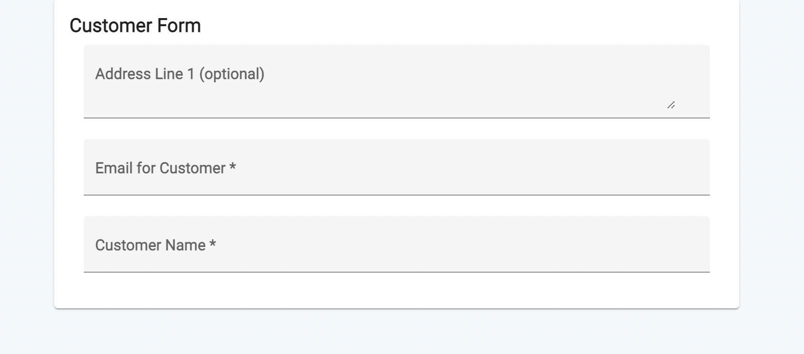

Metadev-Client-Application-Example
===========

## Introduction.

Metadev-client-example is an example project which uses the Metadev client framework. The goal of the framework is to reduce the code written for frontend development. The framework is best suited for [ERP](https://en.wikipedia.org/wiki/Enterprise_resource_planning) apps which have a ton of forms.


**Metadev** is an abbreviation for Metadata driven development.

---

## How it works?

The project is built using Typescript and Angular. Also the framework uses [Material Design Components](https://material.angular.io/). 

[Metadev-Server-Example](https://github.com/supreethavadhani/metadev-server-example) generates the models using json. The generated files are then copied into to the project.
*The generated files can be found [here](https://github.com/supreethavadhani/metadev-client-example/tree/master/src/app/framework-modules/formdata/gen).*

The metadev-client framework is built into the project for this version and can be found [here](https://github.com/supreethavadhani/metadev-client-example/tree/master/src/app/framework-modules).

##### *In the next version the `framework-modules` folder will be packaged and moved into a entirely new project.*

---

## Example.

A frontend developer only needs to write a single line of html code to generate forms.

**The Code**
``` html
<app-mv-field-generator [formData]="fd"></app-mv-field-generator>
```

**The Generated Form** 

---
## Running Locally

1. **Installing Angular**

    Follow [Angular Installation Guide](https://angular.io/guide/setup-local).

2. **Build and Run project**

    1. Open Terminal.
    2. CD to project directory.
    3. Run -
    ```
    npm install --legacy-peer-deps
    ```
    ```
    ng serve
    ```
    4. Open [http://localhost:4200/](http://localhost:4200/).

###### *The project was upgraded from Angular 8 to Angular 13. Hence has a few legacy dependencies.* 

---


## Running On Docker

1. **Installing Docker**

    Follow [docker docs](https://docs.docker.com/get-docker/) to install docker.

2. **Build and Run Docker Container**

    1. Open Terminal.
    2. CD to project directory.
    3. Run the following commands - 
    ```
    > docker build -t metadev-client .
    ```
    ```
    > docker run --rm -it -p 8080:4200 metadev-client
    ```
    4. Open [http://localhost:8080/](http://localhost:8080/).

---

